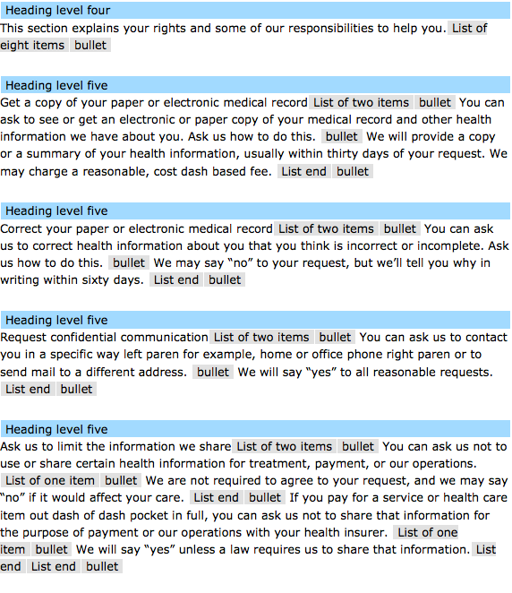

ONC Digital Privacy Notice Challenge Entry
=======

 

Patient Privacy Notice for ONC Digital Privacy Notice Challenge entry for Anatoly Geyfman.

## Introduction

This is a stand-alone application that contains all four patient privacy notices:

 * Provider in English
 * Provider in Spanish
 * Health Plan in English
 * Health Plan in Spanish
 
This application can be easily embedded into any angular app by simply importing its module `oncPpnApp`. This application uses modern web technologies like Angular and Bootstrap to create a usable, fast and most importantly, mobile-friendly way to present patient notices.

## Usability and Mobile-first presentation

This entry was written to be mobile-first. What that means is that the application looks great and works well on any device that has a web browser - iPhone, Android and Windows Phone. More importantly, this application adjusts its presentation based on the device resolution, so that no matter the size of the screen, the notice is usable, easy to read and scan, and the links work as designed.

Print usability has also been taken into account. Each notice in this app is printer-friendly, and ensures that items are legible, hidden items are printed (additional details, for example) and that timestamps are printed on both the top and bottom of the pages.

## Accessibility

This web application follows best practices for creating accessible web applications that can be used by persons with poor or no vision. Care has been taken to create the HTML markup semantically, so that the emphasis is correctly placed on words, so that lists are correctly output by screen readers and so that visual design in no way impacts readability and accessibility of the content. 

Example:

## Customization

The NPP is easy to customize. There are four files, all located in `/app/scripts/services`, each representing a different
patient privacy notice. Within each file, yoi will find a data structure, similar to the one below. To update the notice
information, simply change the text in these files. You can update company info, set a logo, add introduction, applicable
state laws and even notes and electronic access information. Additional content can be added easily.

    {
        logo: '/images/logo.png',
        name: 'Oracle Radiology',
        subtitle: 'The leader in molecular imaging',
        address: {
            address1: '13943 N. 20th Street',
            address2: 'Lower Level',
            city: 'Phoenix',
            state: 'AZ',
            zip: '85021'
        },
        phone: '1235551212',
        fax: '1235551212',
        ppn: {
            introduction: {
                title: 'Welcome to Oracle Radiology',
                text: 'The Notice explains how we fulfill our commitment to respect the privacy and confidentiality of your protected health information. This Notice tells you about the ways we may use and share your protected health information, as well as the legal obligations we have regarding your protected health information. The Notice also tells you about your rights under federal and state laws. The Notice applies to all records held by the Oracle Radiology facilities and programs listed at the end of this Notice, regardless of whether the record is written, computerized or in any other form. We are required by law to make sure that information that identifies you is kept private and to make this Notice available to you.'
            },
            effectiveDate: 1395181351047,
            applicability: 'This notice applies to Oracle Radiology only.',
            privacyOfficer: 'HIPAA Compliance Dept., Phone: 123-555-1212, 13943 N. 11th Ave, Phoenix, AZ 85021',
            signOff: '<strong>By checking this box and clicking the button below, you acknowledge receipt of this notice.  To print this notice, click here <a href="http://www.hhs.gov/ocr/privacy/hipaa/npp_booklet_hc_provider.pdf">hardcopy</a>.  You may also contact our office to request a printed copy.</strong>'
        },
        signAgreementAlert: 'Thank you for signign the agreement',
        stateLaws: 'Put applicable state laws here',
        specialNotes: 'Put any special notes here',
        electronicAccess: 'Electronic access is provided by PatientPrivilege'
    }

## Developer instructions

This application uses a fairly standard Yeoman workflow. First, checkout the application using git, or download it directly from github

    git clone git@github.com:anatolyg/onc_ppn.git
    
Go to the folder where the application is checked out and install the prerequisites. *Note: you should have node.js, grunt and bower installed already, please [see here](http://yeoman.io/index.html) for more info*.

    npm install && bower install
    
You can now run the application. *Note: the default port that the built-in grunt server runs on is 9000, ensure it's open*.

    grunt serve
    
Go to `http://localhost:9000` in your browser to view it.

## Deployment

To build the application, use the `grunt` command to create a deployment. This command will create a new directory within
the checked out directory, containing all of the files necessary for deployment. You can then copy the contents of this
directory to anywhere on your server.

### Linking to PPN from your application

To link to the PPN from your application, use the following URL scheme:

 * `/{{DIRECTORY WHERE FILES ARE STORED}}/ppn/provider/en` <-- Provider (English)
 * `/{{DIRECTORY WHERE FILES ARE STORED}}/ppn/provider/es` <-- Provider (Spanish)
 * `/{{DIRECTORY WHERE FILES ARE STORED}}/ppn/healthplan/en` <-- Health Plan (English)
 * `/{{DIRECTORY WHERE FILES ARE STORED}}/ppn/healthplan/es` <-- Health Plan (Spanish)

### Organization

There are four main pages that have the content for the four patient privacy notices. These are located in the `app/views` folder. The four pages are currently driven by two controllers. One controller has content and contact info for both provider notices, while the second controller handles the health plan notices. You can make each have its own controller by remapping the routing in `app/scripts/app.js` to link the appropriate view to the new controller.

### Testing

Included with this application is a way to test responsive layouts in your browser. When the application is running, simply point your browser to `http://127.0.0.1/tester.html`. This view presents 4 different resolutions so you can fully vet your app's responsive capabilities.
   

